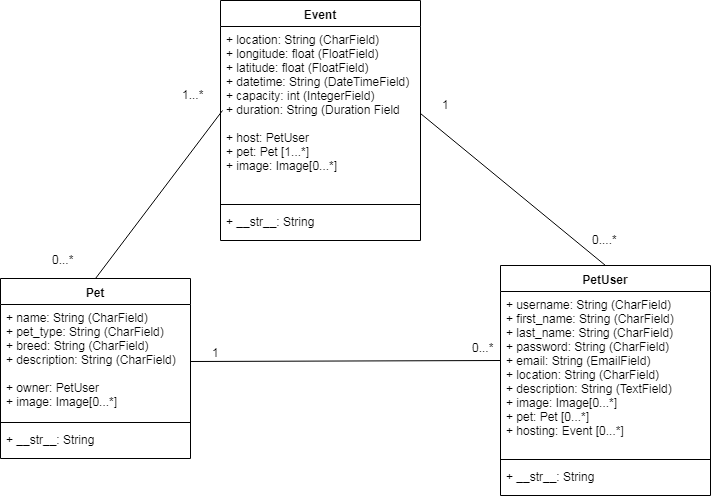

# TEAM NAME: flour

# WEB APPLICATION NAME: Catch

# Overview:

1. Home Page:
    * Now has 4 tabs: Hosting, Going, Interested, and Following. Each tab will sort through the database to parse through events. Right now sorting is not implemented.
    * Added a template in the form of cards to display events
2. Events Page
    * Changed the criteria that we the user can search with. Currently not yet implemented.
    * Adding a template in the form of cards to display events
3. Map Page
    *Added a template to populate the table below the map
4. Profile Page
    * Added a template to populate with the user's profile information
    * Added a template to populate with pets
5. About Page
    * No changes
 
 6. Database has been implemented including mock data population:
    * PetUser:
        * Username
        * First_name
        * Last_Name
        * Password
        * Email
        * Location
        * Description
        * Image
    * Pet:
        * Name
        * Pet_type
        * Breed
        * Description
        * Owner
        * Image
    * Event:
        * Name
        * Host
        * Location
        * Latitude
        * Longitude
        * Datetime
        * Capacity
        * Description
        * Image
        * Duration

# Team Members:

* Bailey Boone, baileyboone
* Erica Zheng, pinebay
* Justin Hui, jhui04
* Parth Nagraj, pdnagraj

# Video Link:
https://www.youtube.com/watch?v=ZSpTD-SxA20&feature=youtu.be

# Design Overview:

We implemented three entities in models.py: User, Pet, and Event, as depicted in the data model diagram above. Each User is identified by his or her username. From User to Event and from User to Pet exist a one-to-many relationship. Because not every User owns a Pet--some simply want to participate in events, a User can be associated with many Pets/Events or none at all. Each Pet is identified by his or her name and owner's username. Each Pet object also has exactly one owner(one-to-one relationship) and at least one Image(one-to-many relationship). Users can host as many Events in which their pets participate. Currently, we designed the models such that each Event can be hosted by only one User, but we may include an event collaboration feature in the future. 

We defined five URL patterns that lead the users to our homepage, events page, map page, profile page, and about page. In the left column of our home page is a box containing four general event filters for events the user has shown interest in: hosting, going, interested, and following. All events in our database are displayed in the homepage in addition to the events page. Also in the events page is a more specific event filter for users to find events they would like to participate in. The map page gives us a visual to where the events are located. The profile page showcases the profiles of our users and their pets. We defined functions in views.py so that upon request of accessing the different web pages, the appropriate HTML file will be loaded with the corresponding context. For example, if a user requested to access our profile page, according to the profile function we would retrieve all instances of Pet and User(this is our context) and load profilePage.html.
# Problems/Successes:

# Team Overview

Problems:
* Populating the database
* Look and feel of the website, how the UI is going to look like figuring that out was a bit of problem 
* Figuring out the different tabs for our website
* Implementing the Django framework 
* There were some problems with sign-in that had to be resolved 
* We did not have a concrete idea on how our framework should look like
* Had some problems delegating tasks
* Had some problems getting our server running from vagrant 
* Had some idea conflicts within the team
* Hard finding times to meet up as a group
* Hard finding times to meet up with TA

Success: 
* We were able to populate the database and get it working
* We were able to figure out how we wanted the site to look like as we were having some conflicting ideas within the group, we just tried out different looks and we used one that felt most comfortable to all of us
* We were able to have the Django framework up and running 
* We were able to delegate tasks and give everyone a sizeable amount of work based on each’s expertise

